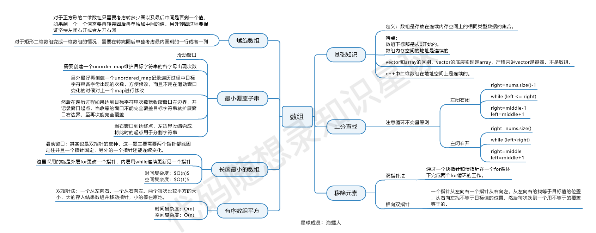

#

## 704 二分查找

前提：有序数组、无重复元素
关键点：边界条件（左闭右闭、左闭右开）

## 27 移除元素

1. **关于循环条件 `<` 和 `<=` 的区别**：
   在外层循环中使用 `for (int i = 0; i < size; i++)` 而不是 `i <= size` 是因为数组（或向量）索引是从0开始的，最大有效索引是 `size - 1`。如果循环条件是 `i <= size`，那么在最后一次迭代时，`i` 会等于 `size`，这会导致访问 `nums[size]`，超出向量边界，从而引发未定义行为。因此，使用 `<` 确保了循环在安全范围内执行，恰当地遍历了向量的所有元素。

2. **内层循环的条件确定**：
   内层循环 `for (int j = i + 1; j < size; j++)` 的目的是将当前元素(`nums[i]`)之后的所有元素向前移动一位，覆盖掉被移除的元素(`nums[i]`)。初始化 `j = i + 1` 是为了从当前检查的元素的下一个元素开始移动，而条件 `j < size` 确保不会越界，因为我们要移动的最后一个元素是 `nums[size - 1]`。

3. **为什么需要 `i--`**：
   当发现一个与 `val` 相等的元素并移除它后，原数组中该位置的元素已经被后面的元素覆盖。为了不跳过可能与 `val` 相等的下一个元素，我们需要将 `i` 减一。这是因为我们刚刚通过移动元素填补了 `nums[i]` 的位置，但循环索引 `i` 已经指向了下一个元素，如果不减一，就会错过检查这个刚被覆盖的位置的值是否也等于 `val`。这样做确保了所有元素都被正确检查，即使是在移除操作之后。

## 977 有序数组的平方

注：排序算法归纳

算法描述：

## 209 长度最小的子数组

核心：起始指针、终止指针

## 59 螺旋矩阵II

在数学中，如果有一个数列从a开始，到b结束（a和b都包含在内），那么数列中元素的总数是b - a + 1