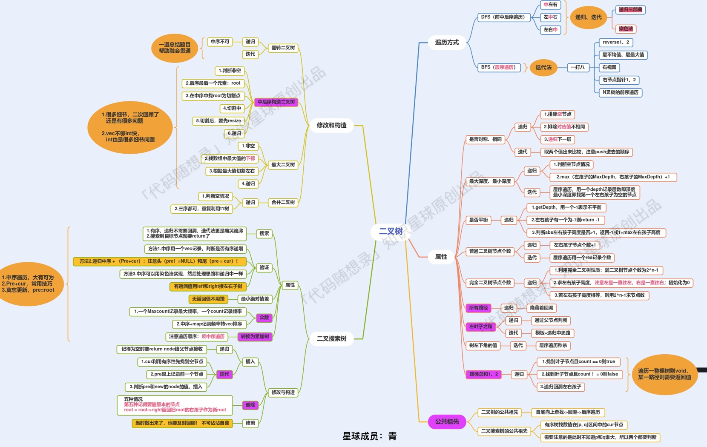
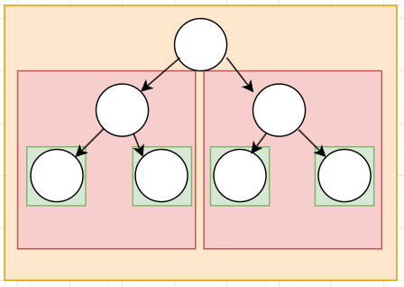

# 概述

树的遍历是指访问树的每个结点，且每个结点仅被访问一次。按二叉树的构成以及访问结点顺序分为四种：先序遍历、中序遍历、后序遍历、层序遍历,其中前三种又称为深度优先遍历(DFS),层序遍历又称为广度优先遍历(BFS).

先序遍历中序遍历后序遍历是依据访问根结点的时机分类的



## 递归简述

在计算机科学中指**一种通过重复将问题分解为同类的子问题而解决问题的方法**，从代码角度表现为函数调用函数本身

递归有两个关键点,终止条件和自身调用:

- 递归式子:当前函数结果与准备调用的函数结果之间的关系,如求阶乘函数factorial(N)=N*factorial(N-1)
- 终止条件:递归的结束条件,到何时不再递归调用下去

那么怎么写递归呢？其实也是按照上述两个关键点展开的

1. 确定递归函数的参数和返回值：确定哪些参数是递归的过程中需要处理的，那么就在递归函数里加上这个参数，并且还要明确每次递归的返回值是什么进而确定递归函数的返回类型。

2. 确定终止条件

3. 确定单层递归的逻辑，即递归式子

递归相比于循环,占用的内存空间较多,因为是不断压栈直到到达终止条件.而且对于本人来说,递归程序的设计比较有难度,还是迭代更有逻辑,条理步骤清晰性一点.那么我为什么还要学习递归呢?首先递归很符合我们一般解决问题的思路,一个递归代码往往很简介,弄懂后总有种豁然开朗的感觉

参考:[程序员必备的基础算法:递归详解](https://www.cnblogs.com/jay-huaxiao/p/13812701.html)

## 二叉树的递归遍历

### 144 前序遍历

遍历过程:根结点-->左子树-->右子树

核心代码如下:

```C++
void preorder(TreeNode *root, vector<int> &res) {
        if (root == nullptr)   //终止条件为碰到空结点
            return;
        //递归式子
        res.push_back(root->val);
        preorder(root->left, res);
        preorder(root->right, res);
    }
```

inorderTraversal

### 145 后序遍历

遍历过程:左子树-->右子树-->根结点

核心代码如下:

```C++
void postorder(TreeNode* root, vector<int>& res) {
    if (root == nullptr) 
        return;

    postorder(root->left, res);
    postorder(root->right, res);
    res.push_back(root->val);
}
```

### 94 中序遍历

遍历过程:左子树-->根结点-->右子树

完整代码：[中序遍历](inorderTraversal.cpp)

### 102 层序遍历

层序遍历在完成某一层结点的访问后，再按它们的访问次序依次访问各结点的左右子树，这样一层一层进行下去，先遇到的先访问，这与队列的操作吻合，故可以设置一个队列结构，从根结点开始遍历：

- 首先根结点指针入队
- 当队列不为空时：
    1. 从队列取出一个元素(包含获取值和弹出)
    2. 访问该元素所指结点
    3. 若该元素所指结点的左右孩子结点非空，则将其左右孩子的指针顺序入队

核心代码：

```C++  
q.push(root);   //根结点指针入队
while (!q.empty()) {    //队列不为空
    int currentLevelSize = q.size();
    ret.push_back(std::vector<int>());
    for (int i = 1; i <= currentLevelSize; ++i) {
        auto node = q.front(); q.pop(); //1. 从队列取出一个元素
        ret.back().push_back(node->val);    //2. 访问该元素所指结点

        // 3. 若该元素所指结点的左右孩子结点非空，则将其左右孩子的指针顺序入队
        if (node->left) q.push(node->left);
        if (node->right) q.push(node->right);
    }
}
```

>说明：以上代码由于要求以每层为一个向量输出，所以和所述算法流程有少许不同，但核心思想是不变的

### 226 翻转二叉树

翻转二叉树实质上还是遍历二叉树的过程

后序递归实现核心代码：

```c++
    TreeNode* left = invertTree(root->left);
    TreeNode* right = invertTree(root->right);

    root->left = right;
    root->right = left;
```

首先递归翻转左子树，然后递归翻转右子树，最后对根结点进行操作，即交换其左右子树

层序遍历实现核心代码：

```C++
    q.push(root);
    while (!q.empty()) {
        auto node = q.front(); q.pop();

        TreeNode* tmpNode = node->left;
        node->left = node->right;
        node->right = tmpNode;

        if (node->left) q.push(node->left);
        if (node->right) q.push(node->right);
    }
```

### 101 对称二叉树

如果一个树的左子树与右子树镜像对称，那么这个树是对称的

所以判断一棵树是否对称，只需要判断**这棵树的左右子树是否互为镜像**，而两棵树互为镜像的条件是：

- 这两棵树的根结点的值相同
- 每棵树的右子树都与另一棵树的左子树镜像对称

这里我们采用递归方法

- 递归函数参数和返回值

    由对称的条件，可以知道递归函数用于判断左右子树是否互为镜像，所以输入参数即为左右子树，返回值即是否互为镜像的判断结果

    ```c++
    bool isMirror(TreeNode* left, TreeNode* right)
    ```

- 终止条件

    当输入的左右子树有空或非空但结点值不等时，递归不再调用下去

    ```C++
    if (!left && !right) return true;
    else if (!left || !right) return false; 

    if (left->val != right->val) return false;
    ```

- 递归逻辑

    ```C++
    bool outSide = isMirror(left->left, right->right);
    bool inSide = isMirror(left->right, right->left);
    bool isSame = outSide && inSide;
    
    return isSame;
    ```

### 104 二叉树的最大深度

二叉树的`最大深度`是指从根节点到最远叶子节点的最长路径上的节点数。
求深度还是需要遍历，依然递归

- 递归函数参数和返回值
  
  输入即一颗树，返回其最大深度

  ```C++
  int maxDepth(TreeNode* root)
  ```

- 终止条件
  
  如果输入是一棵空树，即退出，其深度为0

  ```C++
  if (root == nullptr) return 0;
  ```

- 递归逻辑：

  ```C++
  return max(maxDepth(root->left), maxDepth(root->right)) + 1;
  ```

  笔者采用的是`后序遍历`进行递归遍历，即先递归求解左右子树最大深度，再求当前树的最大深度

### 111 二叉树的最小深度

最小深度是从根节点到最近叶子节点的最短路径上的节点数量

- 终止条件
  
    列出深度为0和1的情况

    ```C++
    if (root == nullptr)
        return 0;  //空树的深度为0
    if (root->left == nullptr && root->right == nullptr)
        return 1;   //无子树的结点深度为1
    ```

- 递归逻辑

    分别遍历左右子树，求其深度

    ```C++
    if (root->left != nullptr) {
        minD = minDepth(root->left) < minD ? minDepth(root->left) : minD;
    }
    if (root->right != nullptr) {
        minD = minDepth(root->right) < minD ? minDepth(root->right) : minD;
    }
    ```
  
### 222 完全二叉树的结点个数

这道题笔者最先想到的是广度优先搜索（即层序遍历），其它部分与基础的层序遍历一致，访问结点即将结点个数记录器加一，完整代码：[完全二叉树结点个数](countNodes.cpp)

既然二叉树的题目可以归结到遍历二叉树，递归法又是遍历二叉树较常见的方法，所以我再试试递归



我想求整棵树的结点个数，可以分解为求左右子树的结点树，左右子树又有左右子树...，所以有点像万花筒或者纸箱套纸箱，子问题就是一个大纸箱里面有几个小纸箱，那么什么时候结束呢，当然是没有纸箱就结束了,即

```C++
if (root == nullptr) return 0;
```

递归逻辑即不断打开纸箱看看下面还有多少纸箱，对于二叉树来说，就是对左右子树个数求和，当然你已经打开了这个纸箱，说明这个纸箱本身是存在的，所以不管下面有没有纸箱了，个数起码是1

```C++
return countNodes(root->left) + countNodes(root->right) + 1;
```

至于官方提供的（二分查找+位运算）后边有机会再研究研究

TODO...

### 110 平衡二叉树

平衡二叉树（AVL树）或者是一棵空树，或者是具有下列性质的非空二叉搜索树：

1. 任一结点的左、右子树均为AVL树
2. 根结点左、右子树高度差的绝对值不超过1

以上是浙大版教材《数据结构》对平衡二叉树的定义，但leetcode中定义为

- 平衡二叉树是指该树所有节点的左右子树的深度相差不超过 1

那就遵循leetcode定义吧

判断是否为平衡二叉树，其实就是要求树的深度，递归逻辑如下：

```c++
return isBalanced(root->left) && isBalanced(root->right)&&(abs(getDepth(root->left) - getDepth(root->right)) <= 1) 
```

即左右子树为平衡二叉树，当前结点左、右子树高度差的绝对值不超过1，求树的深度可以参考[最大深度](maxDepth.cpp)，可以完全照搬，与本题核心关系不大

### 257 二叉树所有路径

> 题目：给你一个二叉树的根结点`root` ，按**任意顺序** ，返回所有从根结点到叶结点的路径。

从根结点到叶结点，很容易想到DFS

当前结点是否为叶结点是一个关键：

- **不是叶结点**：则在当前路径末尾添加该结点，并继续递归遍历该结点的每一个子结点。
  
    ```C++
    if (root->left == nullptr && root->right == nullptr) {  // 当前节点是叶子节点
        paths.push_back(path);
    }
    ```

- **是叶结点**：则在当前路径末尾添加该结点后我们就得到了一条从根结点到叶子结点的路径，将该路径加入到答案即可。
  
    ```C++
    else {
        path += "->";  // 当前节点不是叶子节点，继续递归遍历
        construct_paths(root->left, path, paths);
        construct_paths(root->right, path, paths);
    }
    ```

完整代码：[二叉树所有路径](binaryTreePaths.cpp)

### 404 左叶子之和

本题我们要搜索的结点既是左结点又是叶结点

输入参数：一棵树的根结点
返回值：左叶结点的和
流程：

1. 输入树是否为空树
    是  退出并返回和为0
2. 左结点是否存在
    是  是否为叶结点
        是  将结点值叠加到和
        否  递归直到为叶结点
3. 右结点是否存在
    是  是否为叶结点
        是  递归求左叶结点
完整代码：[左叶子之和](sumOfLeftLeaves.cpp)

### 513 找树左下角的值

> 给定一个二叉树的 根节点 root，请找出该二叉树的 最底层 最左边 节点的值。
>
> 假设二叉树中至少有一个节点。

由于最底层最左边的结点不一定是左结点，这道题用层序遍历较方便

那么对于每一层，我们是应该从左到右还是从右到左呢？由于层序遍历把结点存放在队列中,访问首尾元素方便，所以可以以从右到左的顺序入队

完整代码：[找树左下角的值](findBottomLeftValue.cpp)

### 112 路径总和

> 给你二叉树的根节点 root 和一个表示目标和的整数 targetSum 。判断该树中是否存在 根节点到叶子节点 的路径，使得这条路径上所有节点值相加等于目标和 targetSum 。如果存在，返回 true ；否则，返回 false 。

首先想到深度优先搜索，然后维护结点路径和

输入：一棵二叉树、目标和
返回值：是否存在
思路：

1. 判断输入有效性
2. 更新当前结点路径和
3. 当前结点是否为叶结点
        是    返回**结点路径和**
4. 递归遍历左右子树

完整代码：[路径总和](hasPathSum.cpp)

### 106 从中序与后序遍历序列构造二叉树

中序遍历和后序遍历有以下两个特性：

1. 在后序遍历序列中,最后一个元素为树的根节点
2. 在中序遍历序列中,根节点的左边为左子树，根节点的右边为右子树

输入：中序遍历、后序遍历
输出：被构建的树

思路：

1. 从后序序列获取根结点--最后一个元素
2. 根据根结点将中序序列分为左右子树
3. 在拆分的左右子树序列中递归构建树

注意：后序遍历顺序为L-R-N，则构建树时需按照N-R-L访问

完整代码：[从中序与后序遍历序列构造二叉树](buildTree.cpp)

### 654 最大二叉树

输入：不重复的整数数组nums
输出：二叉树

思路：这道题和106大同小异

1. 从数组中获取根结点--给定序列最大值
2. 根据根结点位置将数组分为左右子树并递归构建树

完整代码：[最大二叉树](constructMaximumBinaryTree.cpp)

### 617 合并二叉树

输入：两棵二叉树
输出：合并后的二叉树

思路：这里采用一种统一的递归方法，除非两棵树的对应结点都为空，不然在一个结点为空时，令其值为0就好了

1. 只要两棵子树不同时为空
   - 获取合并后树的结点的值
   - 构造新结点
   - 递归构造树
  
注意：传入子树作为下次递归的根结点时需判断当前根结点是否存在该子树

```C++
merge_root->left = mergeTrees(root1 ? root1->left : nullptr,
                                root2 ? root2->left : nullptr);
merge_root->right = mergeTrees(root1 ? root1->right : nullptr,
                                root2 ? root2->right : nullptr);
```

完整代码：[合并二叉树](mergeTrees.cpp)

### 700 二叉搜索树中的搜索

一个二叉搜索树（Binary Search Tree，BST）是一棵二叉树，它可以为空。如果不为空,它将满足以下性质:

1. 非空左子树的所有键值小于其根结点的键值
2. 非空右子树的所有键值大于其根结点的键值
3. 左、右子树都是二叉搜索树。

根据BST的以上性质，可以大大减小搜索范围，直观上看是减少了2的指数次搜索，一次少一半

完整代码：[二叉搜索树中的搜索](searchBST.cpp)

### 98 验证二叉搜索树


完整代码：[验证二叉搜索树](isValidBST.cpp)

### 530 二叉搜索树的最小绝对差

处理BST问题时，大概率要用到其一个性质：**BST中序遍历得到的值序列是递增有序的**

所以先写好中序遍历的框架

```C++
int dfs(TreeNode* root) {
    if (root == nullptr)
        return res;

    dfs(root->left);

    // 访问结点
    
    dfs(root->right);
}
```

要求最小绝对差，我们需要跟踪几个变量：前一个结点的值prev，当前最小绝对差res，进行判断时不能跳过任何一个结点，所以初始化prev为负无穷小

```c++
if (prev != INT_MIN)
    res = min(res, root->val - prev);
prev = root->val;
```

完整代码：[二叉搜索树中的搜索](getMinimumDifference.cpp)

### 501 二叉搜索树中的众数

首先采用中序遍历，本题其实也是一个访问结点的题。拿到一棵树，我们其实瞄一样差不多就知道树遍历的顺序。对于代码来说只需专注于访问当前结点的那部分就好了。所以框架还是和503一样，但访问结点部分不一样：
首先我们要定义几个观察追踪的变量并初始化：

```C++
private:
    int cnt_, max_cnt_, prev_;
    vector<int> res_;

prev_ = root->val, cnt_ = 0, max_cnt_ = 0;
```

```C++
prev_ == root->val ? cnt_++ : cnt_ = 1;//判断前后结点值是否相同，相同则计数加1，不同则将当前计数置为1。
prev_ = root->val; //更新结点值
if (cnt_ == max_cnt_)   //当前结点值出现次数等于最大次数，则放进返回数组里
    res_.push_back(root->val);
else if (cnt_ > max_cnt_) { //大于最大次数，则更新最大计数值，并重新装载返回值
    max_cnt_ = cnt_;
    res_ = vector<int>{ root->val };
}
```

完整代码：[二叉搜索树中的众数](findMode.cpp)

### 236 二叉树的最近公共祖先（Lowest Common Ancestor，LCA）

#### 数组

#### DFS法

分为四种情况：

情况一： 当前节点等于目标节点之一，则直接返回该节点。
情况二： 目标节点分别出现在当前节点的左右子树中，则当前节点为 LCA。
情况三： 两个目标节点都在同一子树中，则递归调用子树上的 LCA 函数，返回结果。
情况四： 两个目标节点都不在当前节点的任何子树中，则返回 null。

按照递归逻辑，遍历过程中只要找到了目标结点值立马返回。

```C++
TreeNode* lowestCommonAncestor(TreeNode* root, TreeNode* p, TreeNode* q) {
    if (root == nullptr) return nullptr;    //情况四
    if (root->val == p->val || root->val == q->val) return root;    //情况一

    root->left = lowestCommonAncestor(root->left, p, q);
    root->right = lowestCommonAncestor(root->right, p, q);

    if (root->left == nullptr)
        return root->right;
    if (root->right == nullptr)
        return root->left;

    return root;    //case 2
}
```

[讲解](https://www.youtube.com/watch?v=cOjLyASDJcc&ab_channel=AnujBhaiya)

完整代码：[二叉树的最近公共祖先](lowestCommonAncestor.cpp)

### 235 二叉搜索树的最近公共祖先

思路：

1. 从根节点开始遍历，如果p和q的值都大于当前节点值，则继续遍历右子树；如果p和q的值都小于当前节点值，则继续遍历左子树。
2. 如果p和q的值分别位于当前节点的左右子树中，则当前节点就是LCA。
3. 如果p或q的值等于当前节点值，则当前节点就是LCA。

[讲解](https://www.youtube.com/watch?v=gs2LMfuOR9k&t=157s&ab_channel=NeetCode)

完整代码：[二叉树的最近公共祖先](lowestCommonAncestorBST.cpp)

### 701 二叉搜索树中的插入操作

完整代码：[二叉搜索树中的插入操作](insertIntoBST.cpp)

### 450 删除二叉搜索树中的节点

要删除
完整代码：[二叉搜索树中的插入操作](deleteNode.cpp)